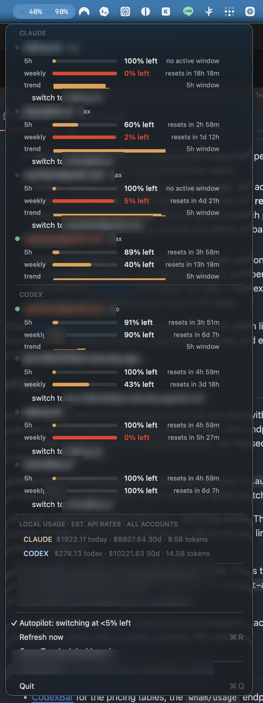

# ai-acct-autopilot

**A native macOS menu bar autopilot for multiple Claude Code and Codex accounts.**
It watches every account, auto-switches before you hit the wall, and resumes
running sessions on the fresh account — so an overnight agent run never dies to
a rate limit while you sleep.



## Why

If you run serious agent workloads on subscription plans (Claude Max, ChatGPT
Pro), you know the dance: watch the usage meter, and when it gets close to the
5-hour or weekly limit, scramble to re-login into another account before your
running sessions stall. Do it at your desk and it's annoying. Have it happen at
3am during an overnight run and the night is lost.

`ai-acct-autopilot` automates the whole dance:

- **One menu bar view** for every Claude and Codex account: 5h / weekly / opus
  bars, "% left", reset countdowns, usage trends, local cost estimates, and
  recent switches — CodexBar-style, always visible on your Mac.
- **Auto-switch at the threshold** (default <5% left on the 5h *or* weekly
  window): the healthiest account takes over, picked by live probed usage.
- **Sessions keep running.** Claude sessions follow the switch automatically;
  Codex sessions are restarted *and resumed mid-thread* by a supervisor shim.
- **Tokens heal themselves.** Stale account credentials are refreshed in the
  background (atomically, with backups) so usage bars never go blind and
  browser re-logins become rare.
- **Local cost panel**: today/30-day spend estimated at API rates from your
  local session logs, per provider, all accounts combined — see what your
  subscriptions are actually worth.

Everything is local: your tokens never leave your machine, there is no
telemetry, and the only network calls are to Anthropic/OpenAI's own endpoints
with your own credentials.

## Requirements

- **macOS** (account storage uses the macOS keychain for Claude)
- **Node 18+**
- [Claude Code](https://code.claude.com) and/or [Codex CLI](https://developers.openai.com/codex) with subscription login(s)

## Install

**Recommended Mac download:**

1. Download
   [AI-Acct-Autopilot-1.1.3.dmg](https://github.com/alnimra/ai-acct-autopilot/releases/download/v1.1.3/AI-Acct-Autopilot-1.1.3.dmg).
2. Open the DMG.
3. Drag **AI Acct Autopilot.app** to **Applications**.
4. Open **AI Acct Autopilot** from Applications or Spotlight.

The DMG is signed, notarized, and stapled. It bundles the autopilot engine and
discovers your system Node 18+ runtime at launch. The menu bar app checks the
latest GitHub release in the background and prompts you when a newer signed DMG
is available.

**CLI fallback:**

```bash
npm install -g ai-acct-autopilot
# or from a clone:
git clone https://github.com/alnimra/ai-acct-autopilot && cd ai-acct-autopilot && ./install.sh
```

This installs two commands: `ai-acct-autopilot` (the watcher, menu bar
installer, and terminal dashboard) and `claude-acct` (the Claude account
manager it builds on).

## Quick start

After the app opens, click the menu bar item and choose
**Manage Accounts...**. First launch opens that window automatically when setup
is incomplete.

The first-run path is:

1. Check the status at the top. **Ready** means all saved accounts and Codex
   resume support look good; **Needs attention** shows the exact missing step.
2. In **Claude**, use **Save Current** for the Claude login already on this
   Mac, or **Add Account** to capture another Claude login.
3. In **Codex**, use **Save Current** for the current Codex login, or
   **Add Account** for an isolated login that will not revoke the active one.
4. If Codex resume support is missing, click **Install Resume**. This installs
   the supervisor shim that restarts and resumes running Codex sessions after a
   switch.
5. Use **Switch** for a manual switch, **Remove** for a saved non-active
   account, **Refresh** after browser logins, and **Diagnostics** when
   something looks wrong.

Autopilot is on by default. When the active account drops below 5% left, the
switch happens by itself, a macOS notification tells you about it, and the menu
bar journal keeps the receipts.

## Mac menu bar app (main UI)

The normal way to run `ai-acct-autopilot` is the native macOS status item:
Claude and OpenAI icons with "% left" for the active accounts. Its dropdown
shows every account's bars, reset countdowns, trends, the cost panel, recent
switches, a live next-check ticker, and one-click manual switching. Its
**Manage Accounts...** window is the onboarding and settings surface for saved
accounts, safe saved-account removal, Codex resume support, diagnostics, and
the few terminal escape hatches that still matter for support.

**Install from npm instead of the DMG:**

```bash
ai-acct-autopilot menubar install   # instant — starts now and at every login
```

No Xcode needed: npm installs ship a prebuilt universal binary (built and
ad-hoc signed by CI; npm-extracted files carry no quarantine attribute, so
Gatekeeper never prompts). The bundle is assembled into `~/Applications`,
sealed, and registered as a launch agent. From a git clone — or with
`menubar install --from-source` — the single-file AppKit app compiles locally
with swiftc instead (`xcode-select --install`).

The npm path remains the fallback and the best option for people who want the
CLI commands in their shell:

```bash
npm install -g ai-acct-autopilot
ai-acct-autopilot menubar install
```

Day to day: Quit from the dropdown means quit (it returns at next login);
restart any time with `ai-acct-autopilot menubar start` or Spotlight →
"AI Acct Autopilot". The Autopilot item pauses/resumes switching instantly
(pause = monitor only); red/amber in the status item follow the same rules
as the terminal UI (red = needs you, amber = handled). If the codex shim is
missing, the alert in the dropdown or Manage Accounts installs it in one click.
When an app update is available, the dropdown and Manage Accounts show a
download action and the app prompts once per release version.
`menubar stop|status|uninstall` manage the npm-installed copy;
`menubar install` again rebuilds after an update or a repo move.

The terminal dashboard is still available with `ai-acct-autopilot` for SSH,
logs, and debugging. It shares the same journal and cooldowns as the menu bar
app, so running both never double-switches.

**Maintainers — DMG signing setup:** add these GitHub Actions secrets, then tag
a release. The workflow imports the Developer ID cert, notarizes, staples, and
attaches `AI-Acct-Autopilot-<version>.dmg` to the release:

- `MACOS_CERTIFICATE_BASE64`: base64 of the Developer ID Application `.p12`
- `MACOS_CERTIFICATE_PASSWORD`: password for that `.p12`
- `APPLE_ID`: Apple ID used for notarization
- `APPLE_TEAM_ID`: Apple Developer team ID
- `APPLE_APP_SPECIFIC_PASSWORD`: app-specific password for notarytool

The workflow also accepts the same secret names used by the other desktop app
releases in this account: `APPLE_CERTIFICATE`,
`APPLE_CERTIFICATE_PASSWORD`, and `APPLE_PASSWORD`.

Local maintainer build:

```bash
xcrun notarytool store-credentials aaa-notary --apple-id you@x.com --team-id TEAMID   # once
npm run build:dmg -- --notary-profile aaa-notary
```

See [docs/release.md](docs/release.md) for the preflight and verification
checklist before tagging a public release.

## How switching works (and the Claude/Codex asymmetry)

| | Claude Code | Codex |
|---|---|---|
| Credential store | macOS keychain | `~/.codex/auth.json` |
| Switch mechanism | keychain swap via `claude-acct use` | `auth.json` swap |
| **Running sessions** | **follow the switch in ~30s** (Claude re-reads the keychain) | hold auth in memory — never re-read ([openai/codex#17041](https://github.com/openai/codex/issues/17041)) |
| Fix for running sessions | not needed | **supervisor shim restarts + resumes them** |

The codex supervisor shim (`codex-shim install`) wraps the codex binary. Every
codex launch goes through it, and when the autopilot switches accounts it:

1. captures each running session's id from the rollout file the codex process
   holds open,
2. terminates the process with a restart marker,
3. relaunches `codex … resume <session-id>` — original flags preserved — so
   the **same conversation continues on the new account** in the same terminal.

Sessions you quit normally exit exactly like stock codex; ctrl-C still belongs
to codex. Fail-open: if anything in the shim breaks, codex launches normally.

### Adding codex accounts safely

`codex login` inside a shared `~/.codex` **revokes the previous account's
session** — that's why `codex-add` runs the login in a throwaway isolated
`CODEX_HOME` and imports the result. Your existing sessions stay alive. Never
add accounts with a plain `codex login`.

## Commands

| Command | What it does |
|---|---|
| `ai-acct-autopilot menubar install\|status\|stop\|uninstall` | native menu bar app |
| `ai-acct-autopilot` | run the terminal dashboard + autopilot (60s ticks) |
| `ai-acct-autopilot --no-switch` | monitor only — shows the switch it WOULD make |
| `ai-acct-autopilot --once --plain` | single tick, plain text (logging/cron) |
| `ai-acct-autopilot app-state --json` | JSON state used by the native Manage Accounts surface |
| `ai-acct-autopilot app-action <action> --json` | JSON mutation contract used by menu bar buttons, including `claude-remove <account>` and `codex-remove <email>` |
| `ai-acct-autopilot app-diagnose --json` | support diagnostics for the native app |
| `ai-acct-autopilot codex-add <email>` | add a codex account via isolated login |
| `ai-acct-autopilot codex-use <email>` | switch codex account (+ resume running sessions) |
| `ai-acct-autopilot codex-list` / `codex-save` | list / snapshot codex accounts |
| `ai-acct-autopilot codex-shim install\|status\|uninstall` | manage the supervisor shim |
| `ai-acct-autopilot --test-decision` | run the decision-logic self-tests |
| `claude-acct add\|save\|use\|list\|usage` | manage Claude accounts (by email) |

Flags: `--interval N` (seconds, default 60) · `--threshold N` (switch when
<N% left, default 5) · `--cooldown N` (minutes between switches, default 10).

## Safety properties

- **Never `/logout`** — logging out revokes Claude sessions server-side;
  account capture always uses overwrite-login.
- **Never switch into the unknown** — a target must pass a live usage probe
  this tick; accounts with failed probes or revoked sessions are excluded.
- **Atomic credential writes** with `.bak` of the previous blob; a failed
  refresh never deletes anything.
- **Safe saved-account removal** — Manage Accounts can remove non-active saved
  Claude/Codex snapshots after confirmation, but never logs out, revokes,
  deletes live auth, or removes recovery snapshots.
- **Cooldown + all-hot hold** — no thrashing; if every account is hot, it
  holds, notifies once, and shows the earliest reset.
- **Append-only journal** (`~/.claude/accounts/switch-journal.jsonl`) — every
  switch, snapshot, and restart with timestamps and reasons.
- **Local-only** — no telemetry, no third-party services, tokens never leave
  the machine.

## How usage is read

- **Claude**: Anthropic's OAuth usage/profile endpoints, per saved account
  token (refreshed in the background when stale).
- **Codex**: `chatgpt.com/backend-api/wham/usage` per account token — works
  for benched accounts with zero sessions; the **regular** account limit is
  used (model-family buckets like the Spark research preview are ignored).
  Rollout session logs provide the offline fallback and the trend sparkline.
- **Costs**: estimated at public API rates from local session logs
  (`~/.claude/projects`, `~/.codex/sessions`), with per-model pricing mirrored
  from [CodexBar](https://github.com/steipete/CodexBar). Estimates, not bills —
  they exist to show what your subscription usage would cost at API rates.

See [docs/how-it-works.md](docs/how-it-works.md) for the full architecture:
token lifecycles, the codex single-session discovery, supervisor internals,
and every endpoint touched.

## FAQ

**Is this safe to run?** It only manages accounts you own, with credentials
already on your machine, talking to the providers' own endpoints. Treat
`~/.claude/accounts` and `~/.codex/accounts` like the secrets they are (the
tool keeps them `0600`).

**What about pinned sessions?** Claude worktree pins
(`claude-acct pin`) are respected — pinned sessions never follow the global
switch, by design.

**A codex switch happened mid-turn — did I lose work?** The thread resumes,
but an in-flight turn is lost (it was about to die to the rate limit anyway).
Re-ask and continue.

**npm upgraded codex and the shim disappeared.** That's the fail-safe
direction: upgrades restore stock codex. Re-run
`ai-acct-autopilot codex-shim install`.

**Linux/Windows?** Not yet — Claude account storage is macOS-keychain-based.
The codex side is mostly portable; PRs welcome.

## Credits

- [CodexBar](https://github.com/steipete/CodexBar) for the pricing tables,
  the `wham/usage` endpoint path, and the visual inspiration.
- Built end-to-end with [Claude Code](https://claude.com/claude-code).

## License

[MIT](LICENSE)
